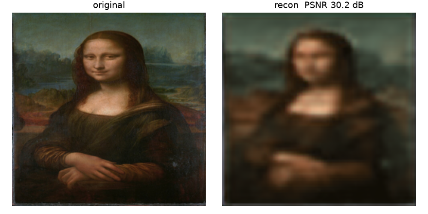
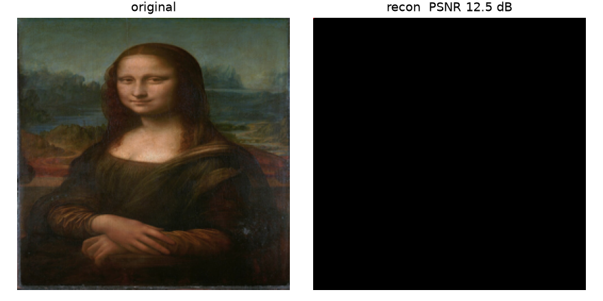
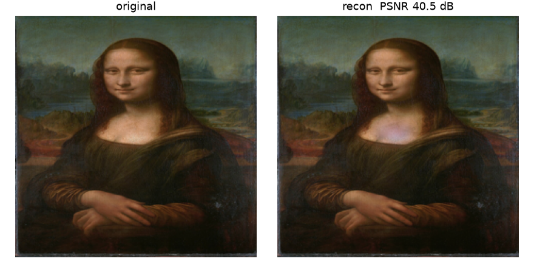

# 卷积自编码器重建蒙娜丽莎：从模糊到近无损的完整优化记录

> 对象脚本：`example_01.py`（单图重建 demo，256×256 RGB）
> 环境：TensorFlow 2.21 (Keras 3)，CPU，conda env `py312`
> 评价指标：PSNR（峰值信噪比，越大越好；40 dB 以上人眼基本难辨差异）

## 结果总览

| 版本 | 结构 | 损失 | 输出激活 | epochs | PSNR |
|---|---|---|---|---|---|
| v0 原版 | Sequential 32/8/8，nearest 上采样 | MSE | ReLU | 500 | **30.19 dB** |
| v1 第一轮 | 加宽 64/128/256，bilinear | MAE | Sigmoid | 500 | 31.69 dB |
| v1 第一轮 | 同上 | MAE | Sigmoid | 2000 | **35.77 dB** |
| v2 U-Net 首试 | U-Net 跳跃连接，无 BN | MAE | Sigmoid | 2000 | **12.49 dB（塌缩）** |
| v3 最终版 | U-Net + BatchNormalization | MAE | Sigmoid | 200 | **40.5–44.1 dB** |

| v0 基线 30.19 dB | v1 35.77 dB |
|---|---|
|  |  |

| v2 塌缩 12.49 dB | v3 最终 44.1 dB |
|---|---|
|  |  |

---

## 调试方法论（本次最重要的流程）

1. **先量化，再优化**：没有指标的"更清晰"无法验证。选定 PSNR 作为唯一判据，每次改动后实测。
2. **定位根因，而非盲目加层**：模糊可能来自容量、损失、激活、上采样、结构——逐一归因。
3. **一次一批可归因的改动，每批都留基线**：v0 → v1 → v3 每步都有 PSNR 和对照图。
4. **失败也是数据**：v2 塌缩不是回退理由，而是定位"深层网络需要归一化"的直接证据。

---

## 第一轮：5 处调参级改进（30.19 → 35.77 dB）

### 改动1：网络加宽 32/8/8 → 64/128/256 通道

- **原实现**：bottleneck 为 32×32×**8** = 8,192 个数，要表达 256×256×3 = 196,608 个像素。
- **原理**：自编码器的重建质量上限由 bottleneck 信息量决定。压缩率约 4% 时，脸部细节在编码阶段就被丢弃，解码器只能"猜"，模糊是必然结果。
- **改后**：bottleneck 32×32×**256**，容量提升 32 倍。
- **教训**：*重建模糊先查瓶颈容量，再查别的。*

### 改动2：上采样 nearest → bilinear（3 处 UpSampling2D）

- **原实现**：`UpSampling2D` 默认 `nearest`，把每个像素复制成 2×2 方块。
- **原理**：最近邻上采样引入马赛克/棋盘状伪影，后续卷积是在"带方块噪声"的特征上工作；双线性插值给出平滑底子，卷积只需补细节。
- **教训**：*上采样方式本身就会制造伪影，不是网络学得好不好的问题。*

### 改动3：输出层激活 ReLU → Sigmoid

- **原实现**：`relu` 输出范围 [0, +∞)，无上界。
- **原理**：像素已归一化到 [0,1]。输出激活的值域必须与训练目标的值域一致，否则亮色像素产生系统性偏置，颜色发闷。
- **教训**：*输出层激活由标签的分布决定，不是习惯用法。* 回归 [0,1] 像素用 sigmoid；回归任意实数用线性（无激活）。

### 改动4：损失函数 MSE → MAE，删除 accuracy 指标

- **原实现**：`loss='mean_squared_error'`，并带 `metrics=['accuracy']`。
- **原理**：MSE（L2）对误差平方，模型在没把握的像素上倾向输出"条件均值"——多个可能取值的平均，平均化在图像上就是模糊。MAE（L1）回归的是条件中位数，不惩罚"坚持一个锐利取值"，边缘更清晰。
- **附带清理**：accuracy 是分类指标，对像素回归无意义，只会污染日志。
- **教训**：*损失函数决定模型在不确定处的行为：L2 求均值（糊），L1 求中位数（锐）。*

### 改动5：epochs 500 → 2000

- **原理**：单图重建本质是"记忆"这一张图，没有泛化问题，也就不存在过拟合风险。网络加宽后参数增多，500 轮远未收敛（实测 31.69 dB），2000 轮到 35.77 dB。
- **教训**：*先确认是欠拟合还是结构上限，再决定是否加训练轮数。* 单图任务增加 epochs 几乎总是安全的。

---

## 第二轮：结构上限与 U-Net（改动6）

### 为什么调参到此为止

35.77 dB 之后继续加 epochs/加宽，收益迅速递减。因为**所有信息必须挤过 32×32 的 bottleneck**：发丝、轮廓、纹理等高频细节在三次 2× 下采样时已物理丢失。这是结构上限，不是训练问题。

> 核心认知：**结构问题不能靠调参解决。**

### U-Net 跳跃连接

- **做法**：把编码器每一层的特征用 `Concatenate` 直接拼接到解码器同分辨率的层：

```
输入 256 ──c1(64ch)──────────────────────┐
        ↓ pool                         Concat←┐
      128 ──c2(128ch)───────────────┐        c6 → 输出 256
        ↓ pool                    Concat←┐
       64 ──c3(256ch)────────┐           c5
        ↓ pool             Concat←┐
       32 bottleneck(512ch) → c4 ─┘
```

- **原理**：细节走"高速公路"绕过 bottleneck 直达解码器；bottleneck 只需学全局结构（光影、布局），不再背负全部细节。
- **API 变化**：跨层连接 `Sequential` 表达不了，必须改用 Functional API（`Model(inputs, outputs)`，层作为函数调用）。
- **代价（要知道的取舍）**：信息绕过压缩点，严格说这不再是"压缩型"自编码器。**压缩率与重建清晰度不可兼得**——教学讲压缩用 v1，讲重建质量用 v3。

---

## 事故与诊断：U-Net 训练塌缩（12.49 dB）

### 现象

第一版 U-Net 训完 2000 轮，输出是一张**纯色均值图**（暗绿色），PSNR 12.49 dB——比原版还差。

### 机理（本次最有价值的诊断）

sigmoid + MAE 在深层网络中的梯度消失连锁反应：

1. 训练初期某次 Adam 更新把输出层预激活值推向极端区间；
2. sigmoid 在极端区的导数 ≈ 0（饱和）；
3. MAE 对输出的梯度恒为 ±1（不像 MSE 随误差放大），无法把输出"拉回来"；
4. 两者相乘 → 梯度 ≈ 0 → 权重不再更新 → 网络永远输出均值色。

网络越深层数越多，初始化不利的概率越大。浅层 v1 用同样的 sigmoid+MAE 能逃出来，深层 U-Net 就卡死了。

> 鉴别要点：**输出塌缩成纯色/均值色 = 训练动力学问题（梯度消失/爆炸），不是容量问题。**

### 修复：改动7，每个卷积后加 BatchNormalization

```python
def conv_bn(x, filters):
    x = Conv2D(filters, (3, 3), padding='same', use_bias=False)(x)  # BN 自带偏置
    x = BatchNormalization()(x)
    return ReLU()(x)
```

- **原理**：BN 把每层的输入分布重新归一化（零均值、单位方差），激活值始终落在 sigmoid/ReLU 的敏感区间，梯度链路全程健康。
- **附带收益**：收敛大幅加快——无 BN 的 v1 要 2000 轮到 35.77 dB，U-Net+BN 仅 200 轮就到 40.5+ dB。
- **教训**：*网络加深时，归一化层不是可选项，是训练能成立的前提。*

---

## 复现性：随机种子要覆盖所有框架

- 脚本原有 `np.random.seed(42)`，注释写着"保证可复现"——**但它管不到 TensorFlow 的权重初始化**。
- 实测同一脚本两次运行：40.54 dB 与 44.06 dB，差异完全来自随机初始化。
- 正确做法：

```python
import tensorflow as tf
tf.keras.utils.set_random_seed(42)  # 同时固定 Python / NumPy / TF
```

---

## 神经网络原则清单（从本次调试提炼）

| # | 原则 | 对应改动 |
|---|---|---|
| 1 | 先定义量化指标再谈"更好" | 全程 PSNR |
| 2 | 重建质量上限 = bottleneck 信息量 | 改动1 |
| 3 | 上采样方式会制造伪影（nearest → 马赛克） | 改动2 |
| 4 | 输出激活的值域必须匹配标签值域 | 改动3 |
| 5 | L2 在不确定处取均值（糊）；L1 取中位数（锐） | 改动4 |
| 6 | 单图记忆任务没有过拟合，欠拟合就加 epochs | 改动5 |
| 7 | 结构上限不能靠调参突破；细节恢复用跳跃连接 | 改动6 |
| 8 | 输出塌缩成均值色 = 梯度消失，先查饱和与归一化 | v2 事故 |
| 9 | 深层网络必须配 BatchNormalization | 改动7 |
| 10 | 压缩率与清晰度不可兼得（跳跃连接绕过瓶颈） | 改动6 取舍 |
| 11 | 随机种子要覆盖所有参与训练的框架 | 复现性 |

## 文件索引

- `example_01.py` — 最终版（v3，U-Net+BN，7 处改动均有中文标注）
- `save/example_01.py` — v1 版本存档（改动1–5，无跳跃连接）
- `images/optimization/` — 各版本重建对照图
